# Recipe App

Recipe app is an online food recipe app.
In this application, users can share their recipes in detail, if they want, they can save and evaluate other shared recipes. This application was made using flutter and dart and the data was stored in firebase.
The firebase services used are:
-Firebase Authentication
-Firebase Firestore
-Firebase Storage

## Home Page

<kbd>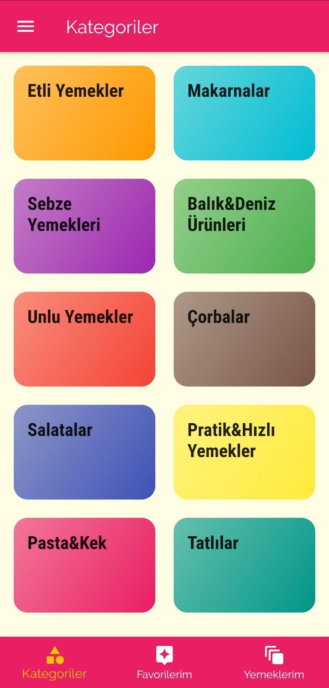</kbd>
<kbd>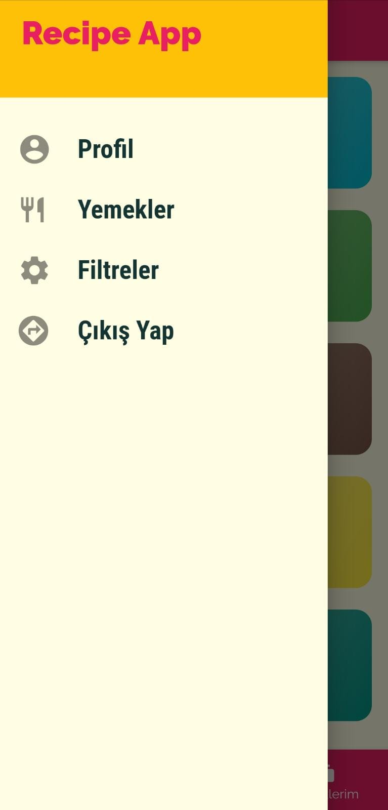</kbd>

## Meal Detail Page

<kbd>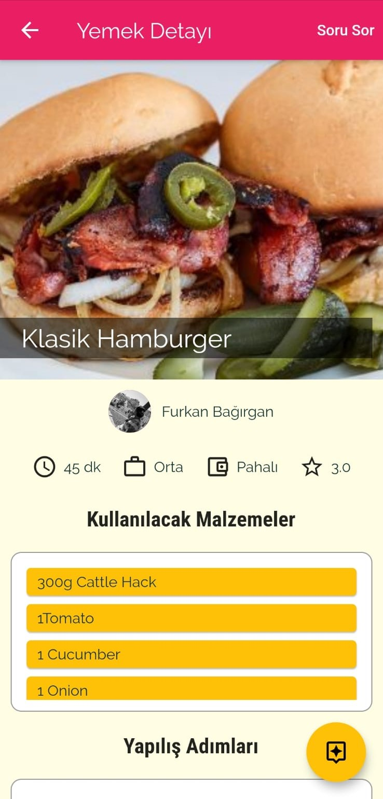</kbd>
  <kbd>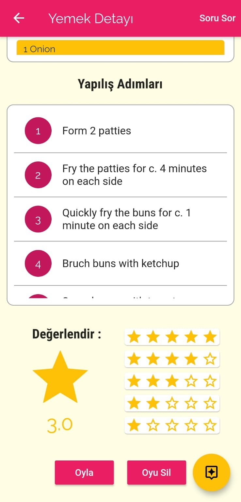</kbd>

## Meals Page

<kbd>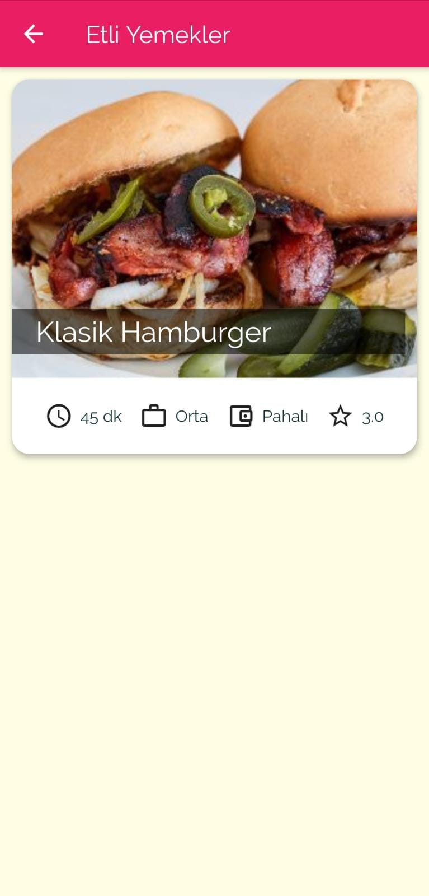</kbd>

## Message Page

<kbd>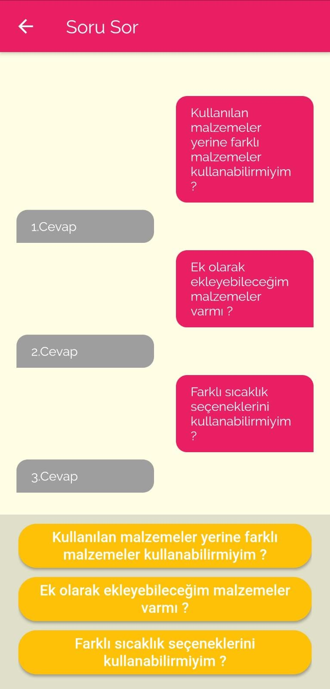</kbd>

## Login Page

<kbd>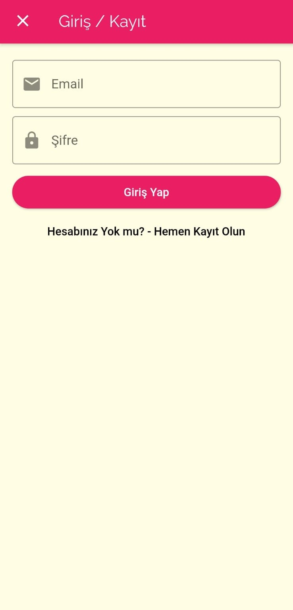</kbd>

## Signin Page

<kbd>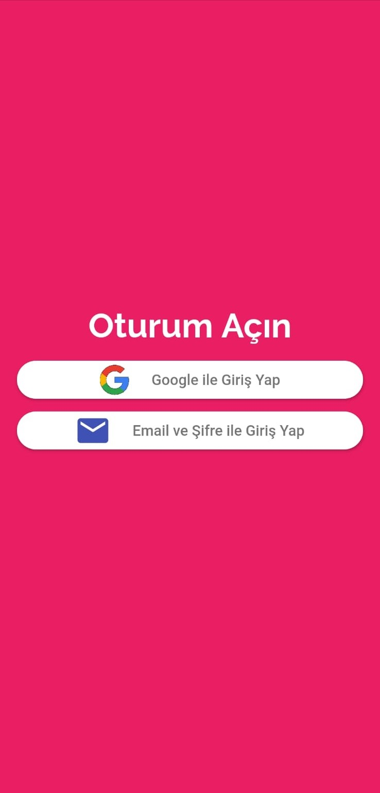</kbd>

## Register Page

<kbd>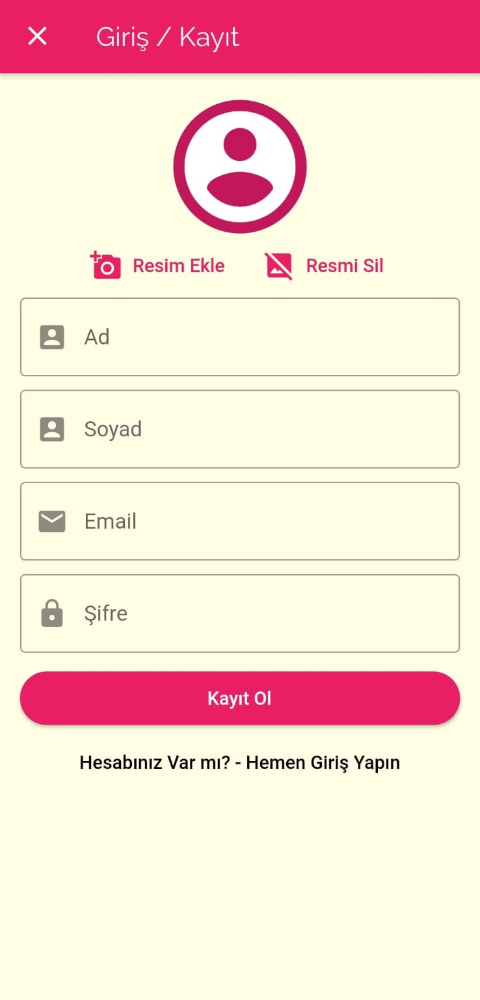</kbd>

## Profile Page

<kbd>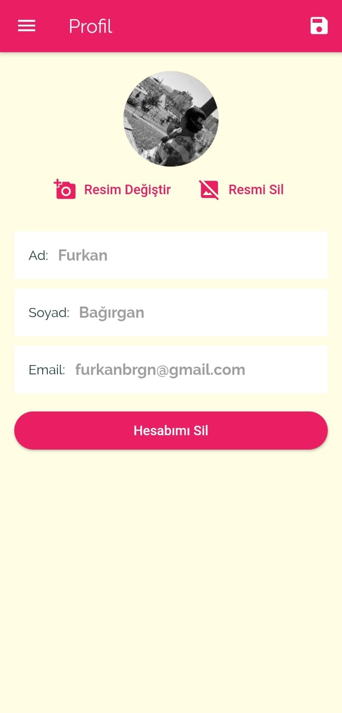</kbd>

## Add Meal Page

<kbd>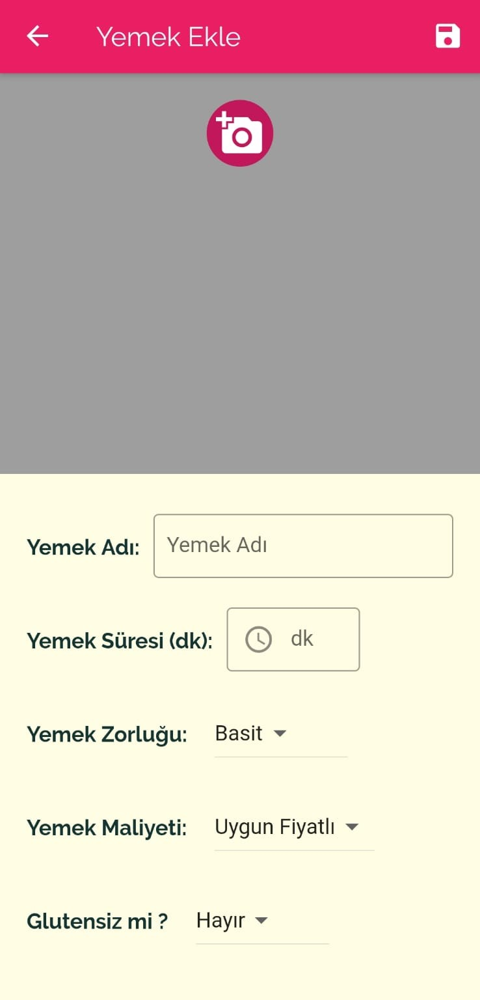</kbd>
<kbd>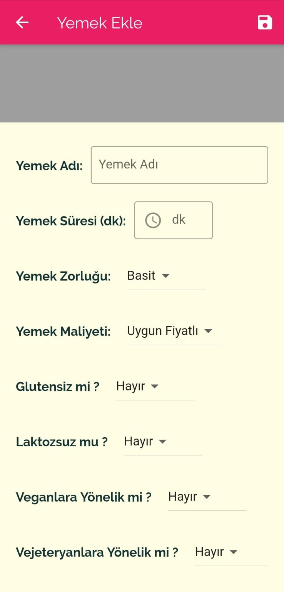</kbd>
<kbd>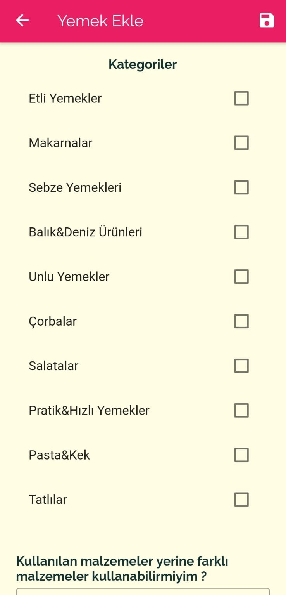</kbd>

## Getting Started

This project is a starting point for a Flutter application.

A few resources to get you started if this is your first Flutter project:

- [Lab: Write your first Flutter app](https://flutter.dev/docs/get-started/codelab)
- [Cookbook: Useful Flutter samples](https://flutter.dev/docs/cookbook)

For help getting started with Flutter, view our
[online documentation](https://flutter.dev/docs), which offers tutorials,
samples, guidance on mobile development, and a full API reference.
